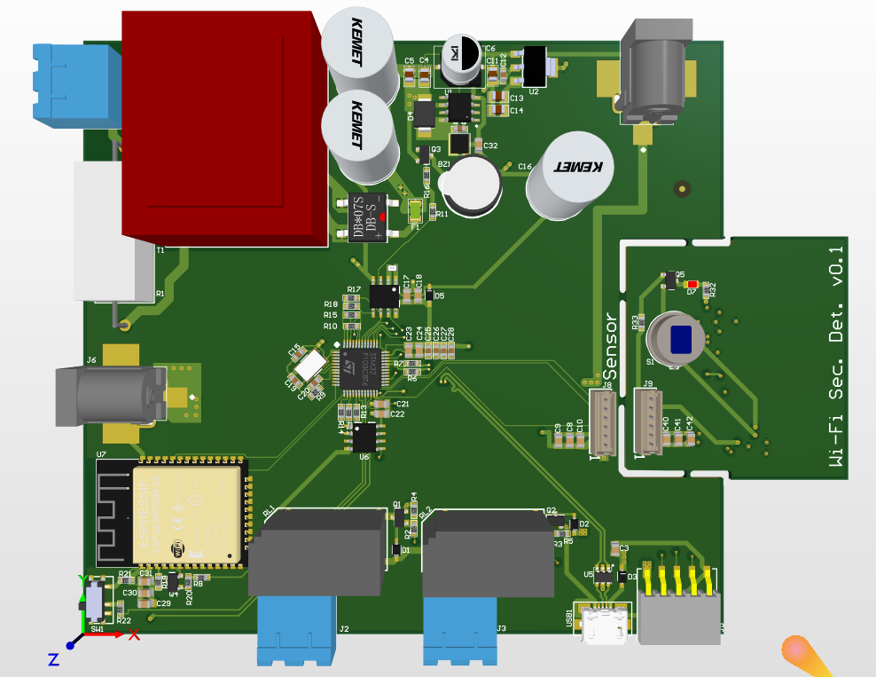
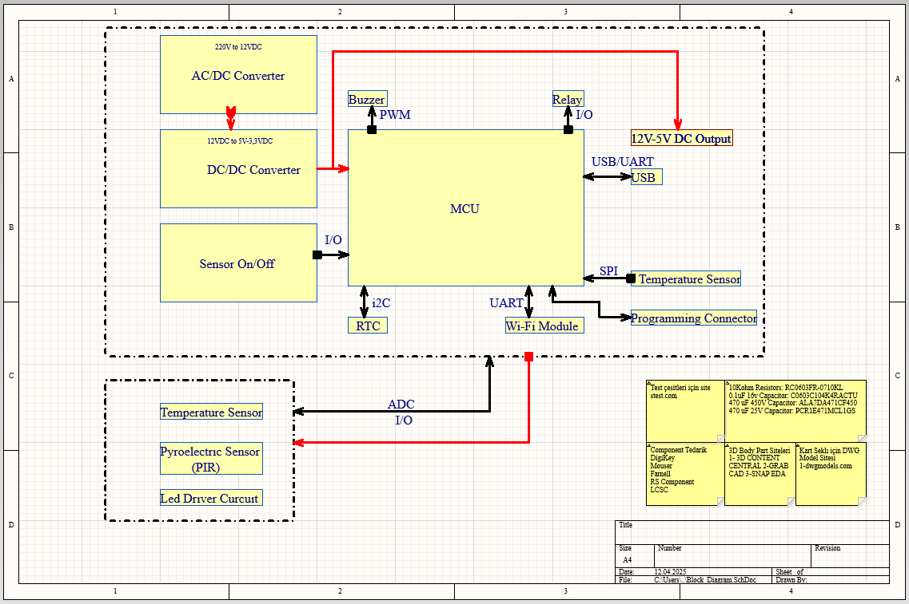

# IoT Smart Security & Motion Detector PCB

This repository contains the Altium Designer files for a custom-designed IoT security node. The board is designed to monitor motion using a PIR sensor and communicate alerts via Wi-Fi, powered directly from AC mains.

## 🚀 Project Overview

This project was developed to master **Altium Designer** workflows, specifically focusing on mixed-signal integration (High Voltage AC + Low Voltage Logic). It combines an STM32 microcontroller for real-time sensor management and an ESP32 for wireless connectivity.

### Key Features
* **Dual-Core Architecture:** STM32F103 (Main Logic) + ESP32 (Wi-Fi/Bluetooth).
* **Onboard Power Supply:** Integrates an AC-DC converter (Bridge + Transformer) to step down 220V to 12V, followed by DC-DC buck converters for 5V and 3.3V logic levels.
* **Modular Sensing:** Features a separate break-out board for the PIR sensor and temperature monitoring to allow flexible placement.
* **Actuator Control:** Includes onboard relays for triggering external alarms or lights.

## ⚠️ High Voltage Warning

**DANGER:** This circuit is designed to handle **110V/220V AC Mains voltage**.
* The high-voltage section is present on the PCB.
* Proper isolation gaps and creepage distances were considered for educational practice but should be verified against standards before actual use.
* **Do not touch** the board while powered.

## 🛠️ Hardware Specifications

| Component | Function |
| :--- | :--- |
| **MCU** | STM32F103C8T6 (ARM Cortex-M3) |
| **Connectivity** | ESP32-WROOM-32 Module |
| **Power Input** | 220V AC (Transformer coupled) |
| **Sensor** | NCS36000 (PIR Controller) + Analog Temp Sensor |
| **Relays** | 2x 12V Relays for external load control |
| **RTC** | M41T00 (I2C Real Time Clock) |

## 📂 System Block Diagram

The system flow is designed as follows:
`AC Mains` -> `Power Regulation` -> `STM32` <-> `Sensors` & `ESP32`

## 🎓 Credits & Acknowledgements

This project was designed and developed as part of the **"PCB Tasarım - Bir Elektronik Kartın Yaşam Döngüsü"** course created by **Mustafa Berk Aydoğan**.

Special thanks to the instructor for the comprehensive guidance on Altium Designer workflows, component selection, and production processes.

## ⚠️ Disclaimer

This PCB design is an **educational project** created strictly for learning purposes.
* It has **not** been tested for electromagnetic compatibility (EMC), thermal stability, or long-term reliability in a real-world environment.
* It is **not intended for commercial use or mass production**.
* Users should exercise caution and verify the design before any attempt at manufacturing.

## 📄 License
This project is open-source and available under the MIT License.
